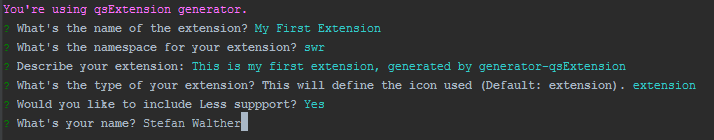

<!---->
# YeoMan Generator for Qlik Sense Extensions

I have created this tool for my daily work. Instead of always reinventing the wheel and setting up a project structure for Qlik Sense Extensions, I prefer to let it generated. 

Generator-qsExtension is based on YEOMAN (http://yeoman.io/) and allows you to create a boilerplate for Qlik Sense Visualization Extensions in **less than two minutes**.

## Demo
Have a look at the following video to get an idea how this tool works and can **save you a lot of time**:

## Installation

Install nodeJs (http://nodejs.org/)
Open the Node.js command prompt and install `yo` using the **Node.js command prompt**
 

    npm install -g yo

Download the `qenerator-qsExtension` from GitHub

    npm install -g generator-qsextension

## Start the Generator

Start the generator by entering the following commands into your **Node.js command prompt**:

Make a new directory, and cd into it:

    md c:\yo\myFirstExtension
    cd c:\yo\myFirstExtension

Run yo generator-qsextension

    yo qsextension

Follow the instructions, you will be asked some questions:

Based on your answers, your customized extension structure will be generated.

## Features

The generator-qsExtension
* Generates a default structure of a working Qlik Sense Visualization Extension
* Creates a deployment system based on [Grunt](http://gruntjs.com/)

### Generated Folder Structure

| Folder 				| Description 											|
| --------------------- | -----------------------------------------------------	|
| **`build`**			| Destination of compressed automated builds (.zip-files), defined in the Grunt task "`grunt/Gruntfile.compress.js`"
| **`dist`**			| Distribution target of automated builds (release mode)
| **`dist_dev`**		| Distribution target of automated builds (dev mode)
| **`grunt`**			| Source of the [Grunt-based](http://gruntjs.com/) build system.
| **`src`**				| Root of source files. **Start working here**
| **`src/lib`**			| Suggested folder structure for assets included in the extension.
| **`src/lib/css`**		| Style sheets for your solution. If you've chosen to use Less-support, then do not modify the style.css, it will be overwritten by the `Less` task in Grunt.
| **`src/lib/less`**	| Folder for your Less definitions. Only applicable if you have chosen to use Less-support.
| **`src/lib/external`**| Put external libraries (e.g. Javascript libraries) into this folder, they will not be modified in any of the Grunt-tasks.

### Generated Grunt Deployment
The Grunt based deployment offers three different modes, `dev`, `release` and `source`:
The settings for the `dev` and `release` task can be changed in `grunt/grunt-config.yml` file.

**Dev Task (Development Deployment)**  

The `dev` task will run trough the following steps, defined in the file `grunt/Gruntfile.js`:

* Preparations
	* Delete existing content in the distribution directory (`dist`)
	* Copy all directory and files from the `src` folder to the `dist` folder
	* Replace variables in all files of the `dist` folder. Variables are defined in the file `grunt/gruntReplacements.yml`, then `gruntReplacments_dev.yml`
	* If Less-Support is chosen: Generate the style sheet `dist/lib/style.css` based on the definition in `dist/lib/less/_root.less`. The generated style-sheet will not be compressed and optimized in `dev` mode.
* Cleanup Tasks
	* Typical development files will be deleted (*.tmp, *.tmpl, *.log, *.bak, *.less)
	* All empty folders in `dist` will be deleted
* Deployment to Qlik Sense Desktop
	* All modified files of the dist folder will be copied to the local Qlik Sense Extension directory (first the entire content of the target folder will be deleted)
* Package
	* Finally the content of the extension will be zipped to a fill called `%ExtensionName%_dev.zip` and stored to the `build` directory. 

**Release Task (Release Deployment)**

* Preparations
	* Delete existing content in the distribution directory (`dist`)
	* Copy all directory and files from the `src` folder to the `dist` folder
	* Replace variables in all files of the `dist` folder. Variables are defined in the file `grunt/gruntReplacements.yml`, then `gruntReplacments_release.yml`
	* If Less-Support is chosen: Generate the style sheet `dist/lib/style.css` based on the definition in `dist/lib/less/_root.less`. In release mode the generated style-sheet will be compressed and optimized.
* Cleanup Tasks
	* Typical development files will be deleted (*.tmp, *.tmpl, *.log, *.bak, *.less)
	* All empty folders in `dist` will be deleted
* Optimization & Uglification
	* All generated scripts will be optimized (compressed) and uglified.
* Deployment to Qlik Sense Desktop
	* All modified files of the dist folder will be copied to the local Qlik Sense Extension directory (first the entire content of the target folder will be deleted)
* Package
	* Finally the content of the extension will be zipped to a fill called `%ExtensionName%_dev.zip` and stored to the `build` directory. 

**Source Task**  
The source task creates a ZIP-file containing the `src` and the `grunt` folder (without installed NodeJs packages) following the schema `%ExtensionName%_**src**_v%Version%.zip`. You'll find the generated file in the `build` folder.

**Grunt Task Configuration**  
As a result of the generator you'll find a file called `grunt-config.yml` in the `grunt` folder.
This file can be used to configure the behavior of both the `dev` and the `release` task.

**Run Grunt Tasks**  
For executing one of the two tasks, enter the following commands in your command-prompt:

Release Task:

    cd grunt
    grunt release

Development Task:

    cd grunt
    grunt dev

## ChangeLog

See [ChangeLog](ChangeLog.md).

## Author
**Stefan Walther** 
* [qliksite.io](http://qliksite.io)
* [github.com/stefanwalther](http://github.com/stefanwalther)
* [twitter.com/waltherstefan](http://twitter.com/waltherstefan)

## License
Copyright (c) 2014-2015 Stefan Walther.
Release under the [MIT license](LICENSE.md).
